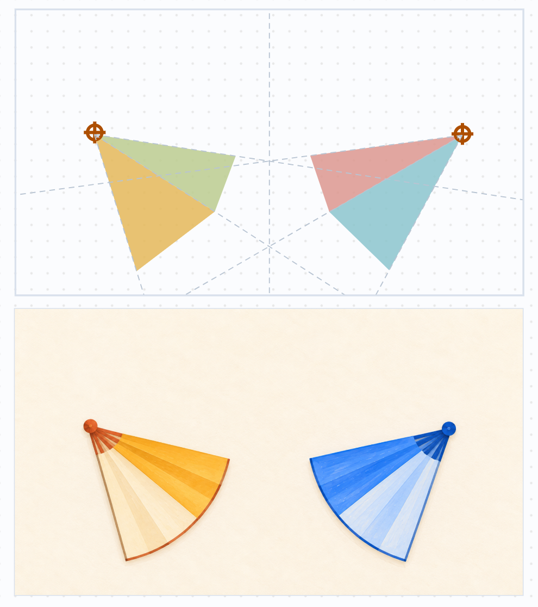
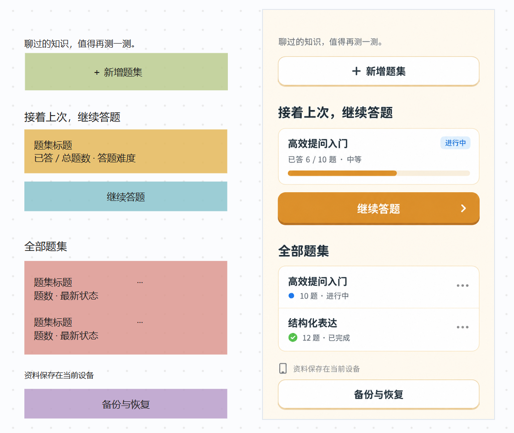
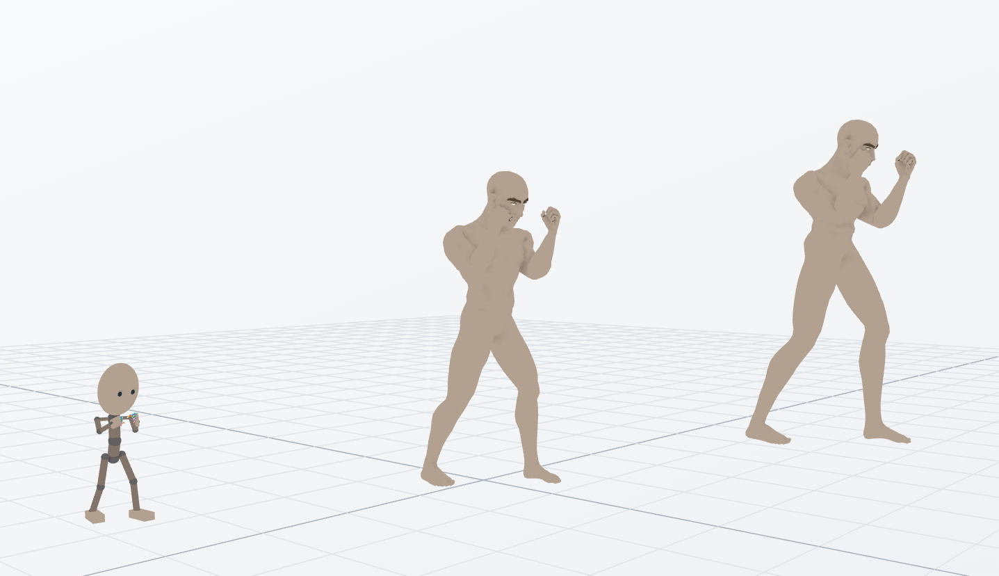
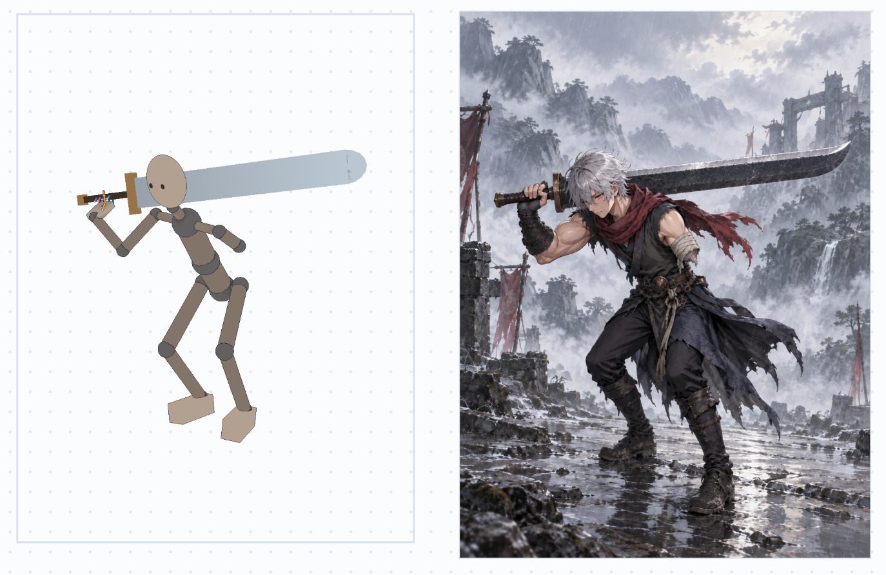
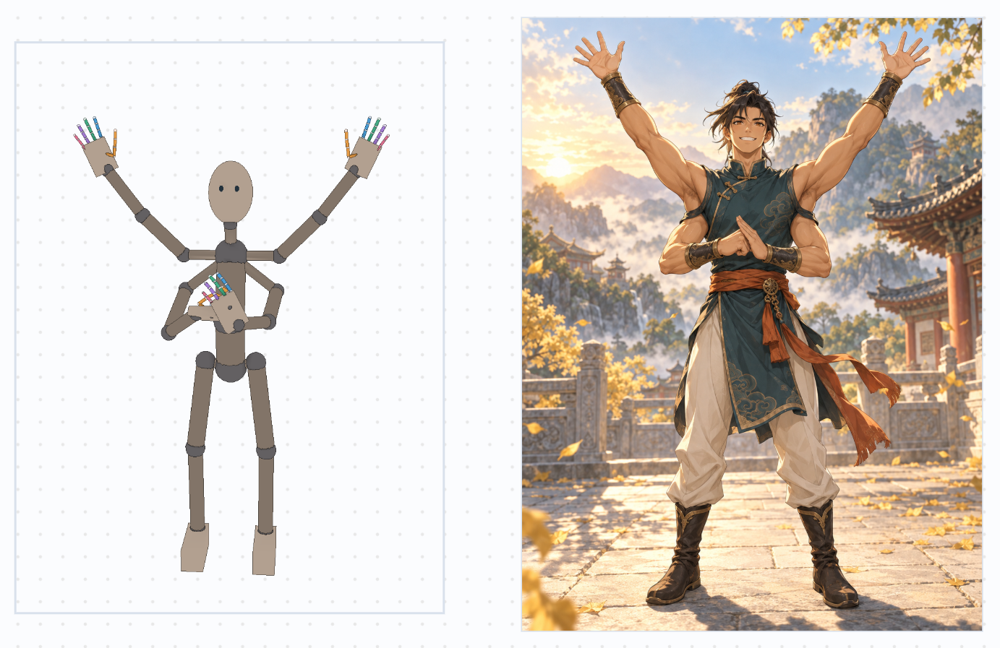
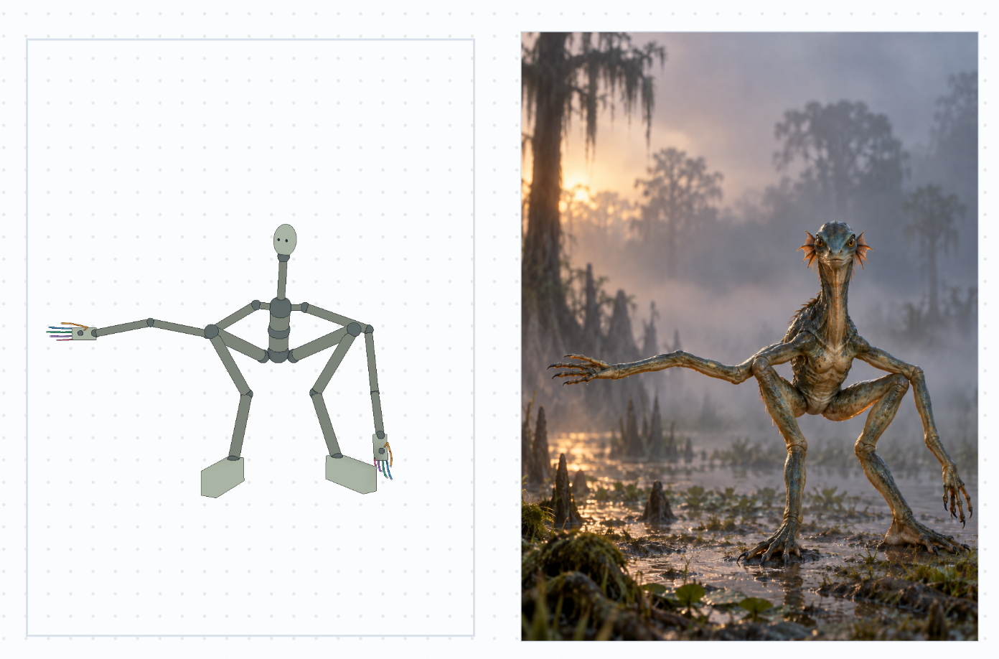

<p align="center">
  
</p>

<h1 align="center">human2ai</h1>

[简体中文](README.md) | **English**

Human2AI is a local creative workspace for people and AI agents. Edit compositions, UI sketches, and 3D spaces in a desktop browser. Agents use the CLI to connect to the same sessions, read versions, make changes, and export results.

## Quick install

Requires Node.js 22+. Install Human2AI globally, then install its skill in each project where you want to use it.

### Ask an agent to install it

Open Codex in the target project and copy this instruction to the agent:

```text
Install Human2AI globally with npm install -g human2ai, then run human2ai integration install --agent codex --mode copy from the current project root to install the Human2AI skill in this project.
Read the installed .agents/skills/human2ai/SKILL.md, start the service, check the integration and service status, and verify that it works. Then tell me the browser URL and the command to start it next time.
If this project already has .human2ai/integration.json, check and reuse its runner and service configuration first, preserving any project changes to the skill.
```

### Install with the CLI

Run these commands in the target project root:

```bash
npm install -g human2ai
human2ai integration install --agent codex --mode copy
human2ai integration doctor
human2ai web
```

Keep the service terminal running and open <http://127.0.0.1:4179> in your browser. The skill is installed in `.agents/skills/human2ai/` within the current project. See [Installation and usage](#installation-and-usage) for details.

## Features

### Composition

Plan a layout with shapes, colors, and composition guides, add notes about the subjects and design requirements, then let an agent develop the design. This example pairs a radial layout with two focal points with the resulting folding-fan image.



### Interface

Sketch a page with color blocks, text, and notes, then let an agent refine its visual design. Keep the sketch and the result side by side on the same canvas to compare and iterate.



### 3D space

Place models, pose characters, and adjust cameras to create spatial references for your design. Bring camera views into a composition to help an agent understand poses, perspective, and occlusion.



Agents can also build and arrange models themselves and create complex poses for characters with weapons, extra arms, or nonhuman proportions, providing spatial references for image generation.







## Requirements

- Node.js 22 or later; source development uses npm 11.
- A desktop browser.
- SQLite and image processing use native dependencies. Installed binaries must match your operating system, architecture, and Node.js version.

## Installation and usage

### Agent installation workflow

Agents can read the public installation instructions with `npm view human2ai readme`. After installation, they can also read `human2ai/README.md` under the directory returned by `npm root -g`. The agent completes the following steps:

1. Confirm the target project directory and the availability of Node.js 22+ and npm. The project does not need a `package.json`.
2. Check for an existing `.human2ai/integration.json`. If present, use its recorded runner to check and retain the project's version and service URLs. For a new integration, install globally with `npm install -g human2ai`, then run the commands under “Install the agent skill” below from the target project root.
3. Read the installed `.agents/skills/human2ai/SKILL.md`, then run `integration doctor` and `service status`. Let the CLI generate integration files, and preserve project changes if synchronization reports a conflict.
4. If the service is not running, execute the configured `service.start` command in a persistent terminal, wait for the service to become available, and retry the checks. Follow any existing project startup convention. A first-time npm installation defaults to port `4179` and the `~/.human2ai/` data directory.
5. Confirm that both integration and service checks return `ready`, the browser URL is accessible, and `session list` can read sessions through the configured runner. If installation reports warnings or vulnerabilities, explain their impact and how they were handled.
6. Report the installed version, project path, skill path, browser URL, and command to start the service next time. The user should not need to install the skill separately.

The automatic integration command currently supports Codex. Users can also perform the same installation themselves with the commands below.

### Install with commands

#### 1. Install the npm package globally

Install once globally to use the `human2ai` command across projects. Consuming projects do not need a `package.json`.

```bash
npm install -g human2ai
```

The package includes prebuilt Web pages, the CLI, database migrations, schemas, and the Human2AI skill. Use `npm root -g` to find the installation directory. Complete the next step to make the skill available to your agent in the current project.

#### 2. Install the agent skill (Codex)

Run these commands in the root of the project where you want to use Human2AI. If the npm package is already installed globally, you can start here:

```bash
human2ai integration install --agent codex --mode copy
human2ai integration doctor
```

The integration command copies the complete skill from the globally installed npm package and creates these files in the current project:

| Path | Purpose |
| --- | --- |
| `.agents/skills/human2ai/SKILL.md` | The Human2AI skill, defining how agents connect, read, edit, and export |
| `.agents/skills/human2ai/references/` | Operation references for compositions, UI sketches, 3D spaces, and related features |
| `.agents/skills/human2ai/agents/openai.yaml` | Skill display information for Codex |
| `.human2ai/integration.json` | The project's CLI runner, service URLs, and skill synchronization records |

When `integration doctor` returns `status: "ready"`, the integration files have passed validation. Check whether the service is running with `service status` in the next step. The connection configuration contains local paths and is excluded by the generated `.human2ai/.gitignore`. The skill can be committed with the consuming project.

Open Codex in the consuming project and find Human2AI in the skill picker. In the Codex CLI or IDE extension, you can also invoke it explicitly through `/skills` or `$human2ai`. Codex automatically discovers new skills; restart Codex if the skill does not appear. See the [official OpenAI skill documentation](https://learn.chatgpt.com/docs/build-skills).

#### 3. Start and verify

```bash
human2ai web
```

This command starts one service that provides both Web pages and the backend API at <http://127.0.0.1:4179>. Other consuming projects using the default configuration connect to this same service. Repeated startup commands reuse a compatible running service.

Keep the service terminal running and open the URL in your browser. In another terminal, run these commands from the same consuming project:

```bash
human2ai service status
human2ai session list
```

Basic installation verification is complete when the service check returns `status: "ready"` and the session list can be read. An empty list is normal for a new data directory. Agents invoke the CLI through the runner in `.human2ai/integration.json`.

### Installation notes and upgrade checks

For an existing project-local installation, if npm warns that the install script for `better-sqlite3` has not been recorded in `allowScripts`, inspect the scripts first. After reviewing this database dependency's native build script, record your approval:

```bash
npm install-scripts ls
npm install-scripts approve better-sqlite3
```

These commands apply to npm versions that provide `install-scripts`. Approval is recorded in the consuming project's `package.json`. If the native module cannot load because its script was skipped, run `npm rebuild better-sqlite3` after approval. Script approval and security auditing are separate checks; use `npm audit` to inspect vulnerability details. See the [npm install scripts documentation](https://docs.npmjs.com/cli/v11/commands/npm-install-scripts/).

If an existing integration reports `update-available` after an upgrade, synchronize the skill as described under “Upgrade an installed package” below. Follow the command's conflict report to preserve changes in the consuming project.

### Connect to and use sessions

```bash
human2ai session connect --session <session-id>
human2ai session open --session <session-id>
```

`session connect` returns the browser URL, the latest Capture version, and the commands supported by the current session. `capture get` reads a specific version, `capture save` saves a new version, and `capture undo` appends a restored version. Project IDs and session IDs organize work from different projects within the same local service.

Composition, UI, and 3D space sessions can use the style library at `/styles/`, with Visual, UI, and 3D categories. A consumer project’s Agent can combine the full style specification with spatial layout, scale, pose, and camera guidance to build models in that project. Binding a style does not modify the guide scene. Agents can work with the same library through `style list|get|create|update|add-reference|remove-reference|set-model|remove-model|delete`. See the [Human2AI skill](skills/human2ai/SKILL.md) for the full command reference and collaboration workflow. A style can also store one program-generated GLB example, with rotation, zoom and reference-image switching in its detail view. Agents save it using `style set-model --style <id> --input .human2ai-data/output/example.glb --expected-revision <n>` (self-contained GLB, up to 10 MB); `style remove-model` accepts the same style and revision arguments to remove it.

## Data and generated files

| Environment | API port | Database | Session images and style reference images |
| --- | --- | --- | --- |
| npm installation | `4179` | `~/.human2ai/human2ai.sqlite` | `~/.human2ai/artifacts/` |
| Source development | `4180` | `<source-repository>/.human2ai-data/human2ai.sqlite` | `<source-repository>/.human2ai-data/artifacts/` |

Development and installed versions store data separately. `HUMAN2AI_PORT`, `HUMAN2AI_DATABASE_PATH`, and `HUMAN2AI_ARTIFACTS_PATH` override the corresponding settings. If no image directory is specified, it defaults to an `artifacts/` directory beside the database. The service listens only on the local loopback address.

The default environment is determined by the location of the Human2AI package being executed. Services and CLI commands in a source checkout use development defaults; an npm installation uses production defaults. Startup does not automatically copy, merge, or clean either data set. Existing sessions copied from a common source are preserved, and subsequent changes are stored separately.

To verify upgrade compatibility, run the new version in an isolated directory using backup copies of an older production database and its images. Check migrations, access to old sessions and images, and saving changes. Development and production data can originate from the same snapshot while using separate database files. Preserve existing development data before refreshing a test snapshot. For a running database, use the SQLite backup API; alternatively, stop the service before copying the entire data directory.

In the Human2AI source repository, put exported images, prompt records, and temporary results in `.human2ai-data/output/`. Existing composition outputs can go in `.human2ai-data/exports/`, and backups in `.human2ai-data/backups/`. The CLI writes `--output` and `--preview` files to the specified paths, so callers should choose these ignored directories.

For example, export a saved UI sketch version from the development service. The output extension can be `.png` or `.svg`:

```bash
mkdir -p .human2ai-data/output
npm run cli -- --api-url http://127.0.0.1:4180 ui-layout render --session <session-id> --revision <revision> --output .human2ai-data/output/ui-layout.png
```

Internal `docs/` and `.human2ai-data/` remain local and are excluded from both Git and the npm package. Ignore rules also exclude databases and their WAL/SHM files. After stopping the service, back up the entire data directory to preserve both the database and images. Use the SQLite backup API for online database backups.

## Source development and everyday use

Run these commands in the Human2AI source repository:

```bash
npm ci
npm run dev
```

The development Web UI runs at <http://localhost:3000>, and the API at <http://127.0.0.1:4180>. The Web UI supports hot reload, the API restarts when its source changes, and the CLI build updates as its source changes. A compatible service already running on the port is reused. To run a changed backend, stop the old service on that port first.

In another terminal, run the CLI source directly from the source repository:

```bash
npm run cli -- --api-url http://127.0.0.1:4180 --web-url http://localhost:3000 service status
```

To install the skill from the source repository into another local project:

```bash
npm run build:server
npm run cli -- --api-url http://127.0.0.1:4180 --web-url http://localhost:3000 integration install --agent codex --root /absolute/path/to/consumer --mode copy
```

Source integration defaults to development API port `4180` and Web port `3000`. The generated `service.start` runs `npm run dev` in the source repository. The integration's CLI runner points to `dist/cli/main.js` in that repository, and the build updates automatically while the development service is running. Run `npm run build:server` once before the first integration; you can also build manually when the development service is stopped. `--mode link` links only the skill files.

Local consuming projects can stay connected to the source development version to test features that have not been published. Each project invokes the CLI according to its own `.human2ai/integration.json`. Local development does not require an npm release; npm packages distribute versions that have been verified for external use.

After updating the source skill, run `integration sync --check` to inspect changes, then `integration sync` to apply them. Synchronization preserves conflicting skill changes made in the consuming project.

Run Storybook with `npm run storybook`; its default URL is <http://localhost:6006>. The synchronized UI source can be built independently. Access to the private upstream repository is needed only when maintainers update YisiUI.

## Upgrade an installed package

Update the global package, then synchronize the skill from the root of each integrated project:

```bash
npm install -g human2ai@latest
human2ai integration sync --check
human2ai integration sync
```

Stop the service and back up its data directory before upgrading. Run `human2ai web` again after the upgrade. Database migrations run at startup. If you roll back the software, restore a data backup compatible with that version.

## Verification and local packaging

```bash
npm run repository:check
npm run i18n:check
npm run domain-baseline:check
npm run pack:check
npm run domain-baseline:test
npm run typecheck
npm test
```

Create a package, then test its installation in a separate consuming project:

```bash
mkdir -p .human2ai-data/packages
npm pack --pack-destination .human2ai-data/packages
```

Run `npm install -g /absolute/path/to/human2ai-0.1.6.tgz`, then follow the integration and startup steps above in a separate project. Package checks verify required files and licenses and reject internal documentation, databases, and user-generated files.

## License

Human2AI's own code is licensed under [MIT](LICENSE), with copyright attributed to 贾思斋. The full YisiUI MIT license is included in the package at `licenses/YisiUI-LICENSE`. Quaternius models retain their [CC0 notice](assets/quaternius/License_Standard.txt). Original dependency notices are included at `licenses/THIRD-PARTY-NOTICES.txt`; each dependency remains subject to its own license.
